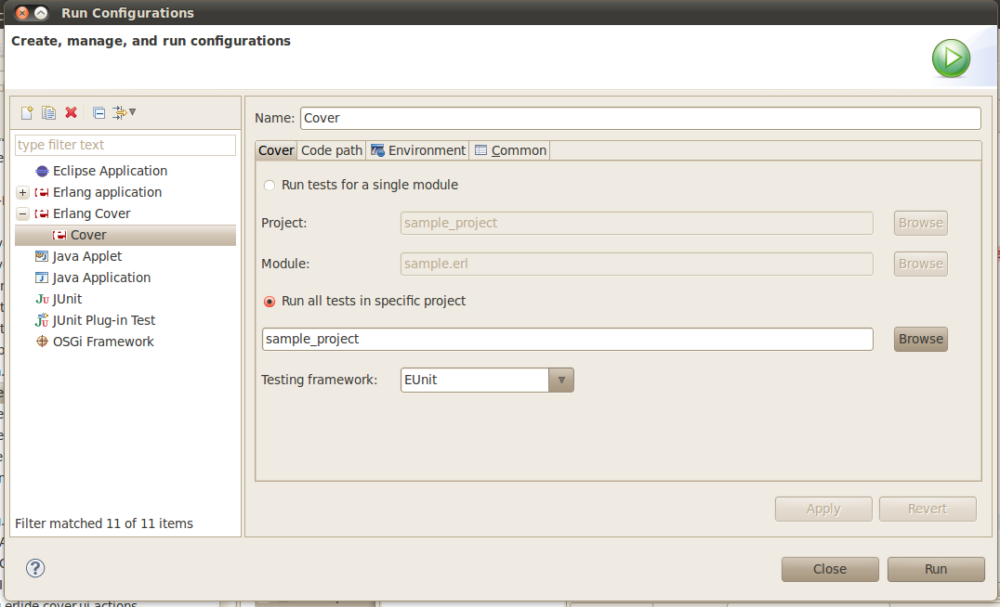
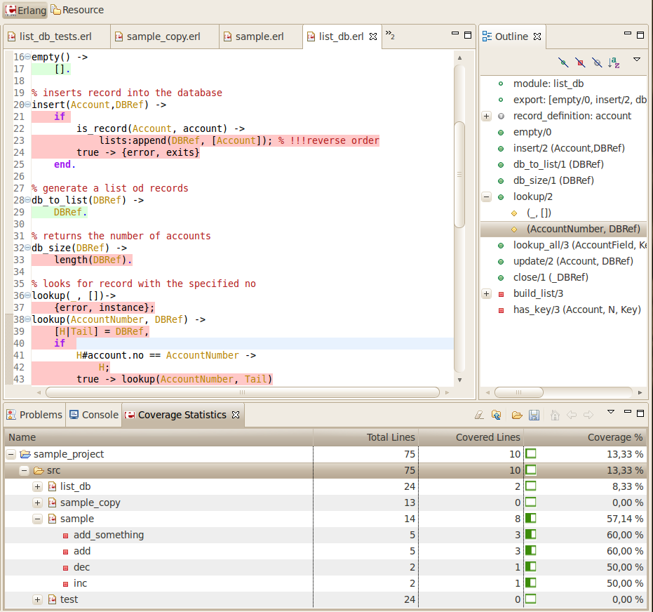
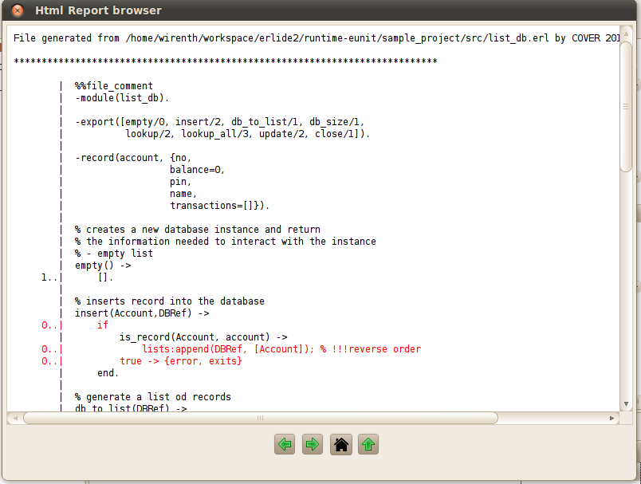

# Cover plugin example

Learn how to use Cover plugin.

## Cover plugin configuration

The following paragraph concerns using Cover plugin without any other testing plugin. Only testing with EUnit is possible today.

There are two options: you can measure code coverage for a **whole project** or for **single module**. Cover plugin uses the following convention:

*  analysed modules are in source folders
*  tests are in **'test'** folder or in **'source_folder/test'** (where source_folder is any folder considered as source folder). 

_Remember, when placing tests in different place, your tests may not be found_

{: .frame }

## Code coverage analysis results.

When you perform coverage analysis over your project, you will see covered lines marked green and uncovered lines marked red. You also will be able to view statistics per function, module, source folder or whole project. By clicking on an item in the statistics tree you can open it in the editor. You can also turn on and of coverage marking whenever you like, except when source code has been changed (to eliminate incorrect marking).

{: .frame }

Coverage analisis results are also available in form of HTML reports. You can view it from Eclipse or export.

{: .frame }

HTML reports for modules are the same that are generated originally by cover tool.

{: .frame }

If you like to save your results and restore it later you can do it as well. 
