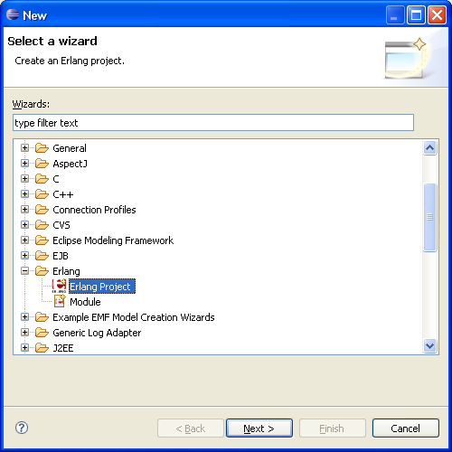
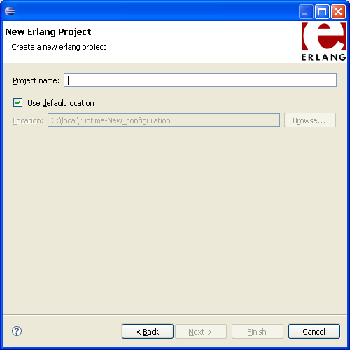
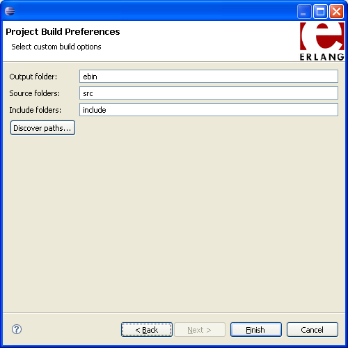

# {{ page.title }}

To create a project:

1. Click File -> New -> Other... -> Erlang Project or use the context menu
in the navigator, right-clicking and choosing New -> Erlang Project

  {: .frame }

2. In the New Erlang Project wizard, enter the project name and if needed
choose the project's desired location. If you already have code in that location, it will be recognized and imported.

  {: .frame }

3. Click Next.
4. In the **Project Build Preferences** boxes, type Output, Source and
Include folders or use the default values.

  {: .frame }

5. To create your project, click Finish.

