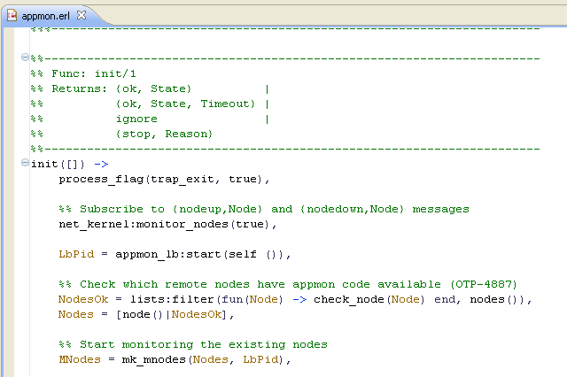

# Editor

The Erlang editor provides specialized features for editing Erlang related
files.

{: .frame }

Associated with the editor is an Erlang-specific outline view, which
shows the structure of the active `.erl` or `.hrl` file. It is updated as you
edit these files.

The editor includes the following features:

* Syntax highlighting
* Content/code assist; auto completion of function calls, display of
function documentation)

The most common way to invoke the Erlang editor is to open a file from the
Erlang Navigator. If you want to open an Erlang module by name, the keyboard
shortcut is **Ctrl+Shift+M** or **Ctrl+Alt+Shift+M**.

